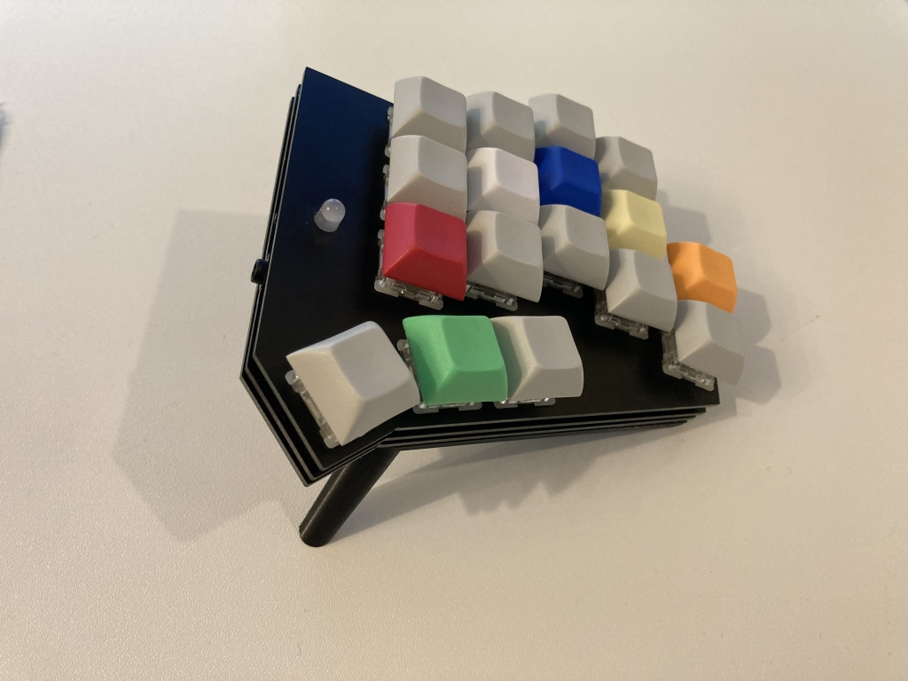
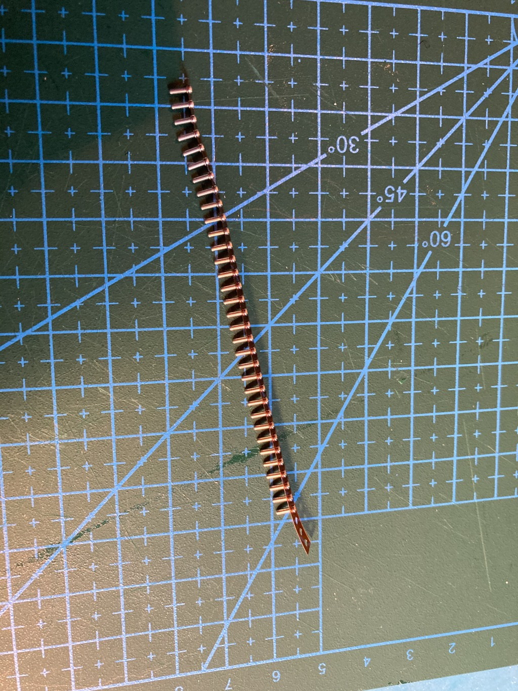
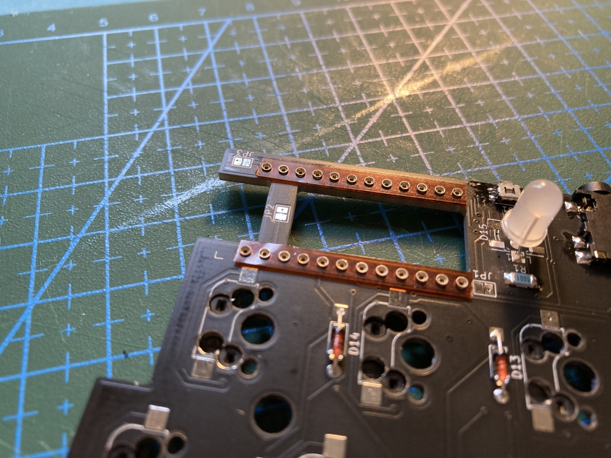
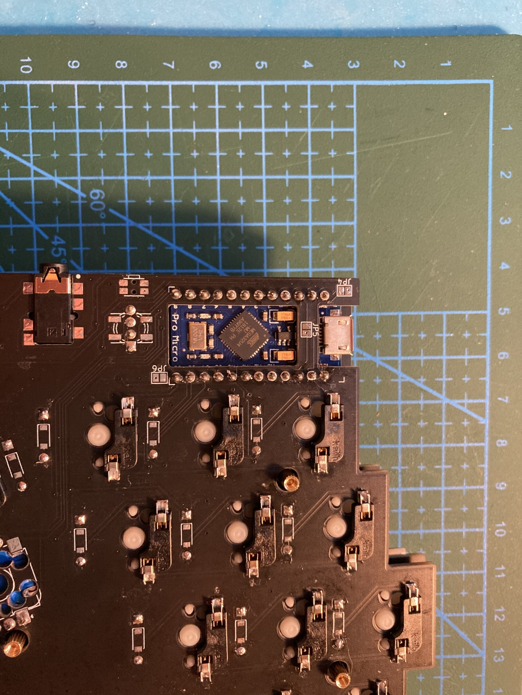
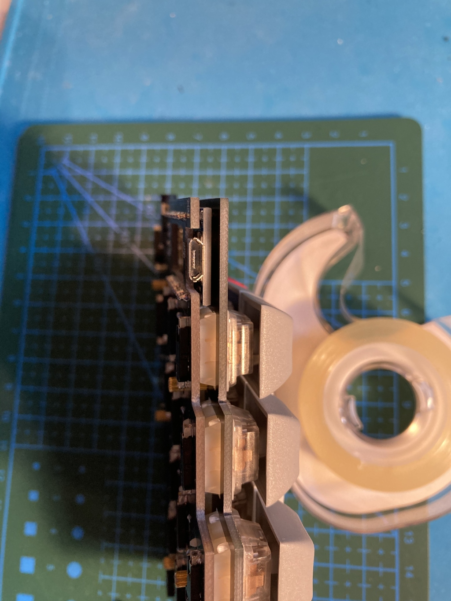
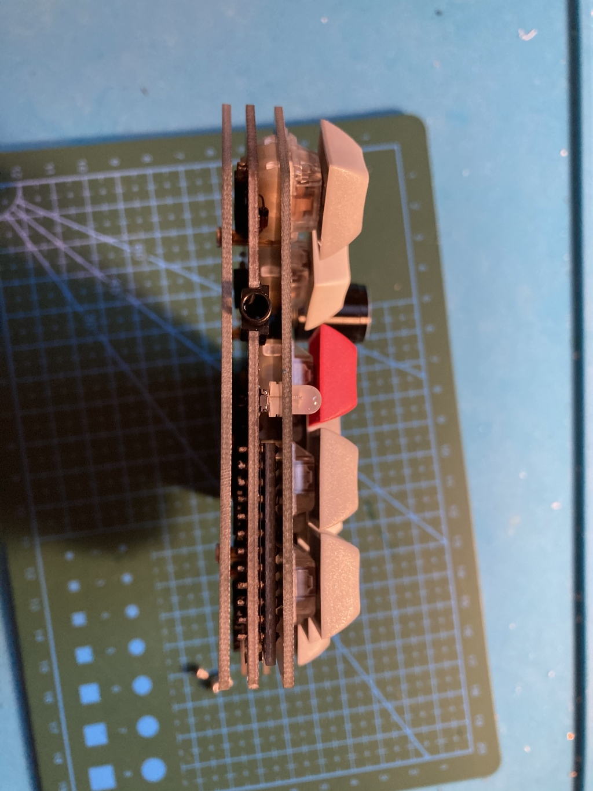

# Amber
Personalized split keyboard based on [Zebra](https://github.com/nezumee/zebra) experimentation.

# Bill of material

* PCB x2, switch plate PCB x2, bottom plate PCB x2 (see [gerbers](gerbers), all PCBs are reversible)
* ProMicro or equivalent x2 (if using something other than ProMicro, check if it will fit in the PCB cutout!)
* Mid-mount TRRS jack x2 (https://www.digikey.com/en/products/detail/cui-devices/SJ-43504-SMT-TR/2625173 or PJ342C in https://www.aliexpress.com/item/1005001299482943.html)
* Tactile switch x2 (https://www.digikey.com/en/products/detail/panasonic-electronic-components/EVQ-P7C01P/4429458)
* RGB LED x2 (https://www.digikey.com/en/products/detail/inolux/HV-5RGB60/7604616 or compatible)
* 1k Ohm resistor in 1206 size x2
* EC11 rotary encoders x0-2
* N4148 x32 in DO-35 (through hole) or SOD123 (surface mount) form factor
* KailH sockets x32-34 (you need less than 34 if using encoders)
* Cherry MX compatible switches x32-34
* Keycaps
* TRRS cable

# Making a PCB sandwich keyboard starting with an ergogen definition
This design was created with help of the https://github.com/mrzealot/ergogen tool that makes it easier to generate keyboard plates and PCBs.

Rough steps used:
1. Generate PCB and outlines using ergogen: [ergogen.yaml](ergogen.yaml)
2. Create a Kicad schematic with switches and diodes, matching the ids created by ergogen, make a PCB based on that
3. Overwrite the Kicad PCB with the one coming from ergogen
4. Update PCB from schematic, preserving references but updating the nets and footprints as needed
5. Import the edges layer from ergogen outline, keep default position so outline matches the switch positions
6. Continue designing the PCB in Kicad as normal

# Fitting the ProMicro between the switch plate and PCB
Many keyboards using ProMicro (like Corne) either have the ProMicro exposed, or use a small plate to cover it separately from the switch plate. While the tech prototype look of showing the MCU is nice, sometimes you want something cleaner looking, and also less prone to gathering visible dust. With this in mind, I decided to make the front plate that serves both as a plate for the switches and also covers all the components on the PCB. This led to a few challenges:

1. Fit the ProMicro and its socket (yes, I didn't want to solder it to the PCB directly) between the PCB and the front plate. This required a surprising amount of effort:
  * Use the thinnest sockets I could find - Peel-a-way sockets (https://keeb.io/products/peel-a-way-sockets-for-pro-micros). They seem to be difficult to source, luckily I got some beforehand. Note that these sockets require bigger holes than you would normally have. My first iteration of the PCB had too narrow holes so they could not fit. 1.1mm in the second version is enough:

  * Mount ProMicro upside down
  * Make a cutout in the PCB to fit the components on ProMicro
 
  * The cutout and the fact that ProMicro is stuck between switches and the end of the board made routing quite difficult. Leaving a bridge between the left and right pin columns helped, but common ways of making reversible PCBs couldn't work. There is no space for dual ProMicro footprint, and I cannot reverse the ProMicro either since it becomes too tall to fit. I didn't want to mount it below the PCB either since there's even less space there.
  * To make the PCB reversible, I ended up using different pinouts for the left and right halves. For example, the index finger column (CI) is connected to B2 on the left side, but is mirrored to B4 on the right. This solved most of the pins at the cost of complicating firmware. A few that could not be reassigned, like VCC. For those, I added jumpers that are cut and soldered depending on which side is being built. For left side, you connect J1-J3 and cut J4-J6 (default). For the right side, you do the opposite.
 
2. Fit a TRRS jack between the plates. The jack commonly used is even thicker than ProMicro with a socket. Luckily, it turned out there are special mid-mount jacks that mount into a cutout in the PCB: CUI Devices SJ-4350 series available on DigiKey, or PJ342C available on AliExpress (I got both; despite the differences in diagrams on seller sites, the ones I got look identical).

3. Fit a reset button between the plates. This was straightforward, there's a number of thin tactile buttons available. I picked a small switch with button on the side. It turned out to be difficult to press, but I feel it's not a big deal since I don't use it often. Reset command can be added somewhere in the layout if needed.

With this, everything fits between the plates comfortably:

Of course, I waste all this effort by almost always using the keyboard with tented legs, attached using magnets: [Things/Tented-base.stl](Things/Tented-base.stl).